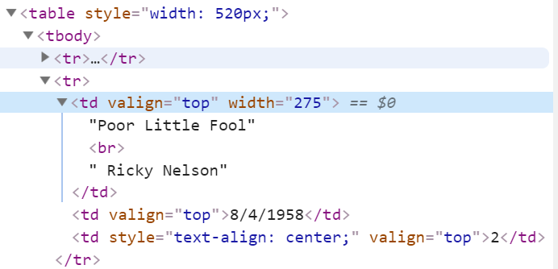
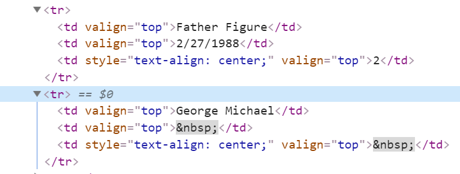
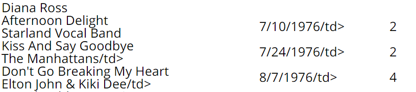
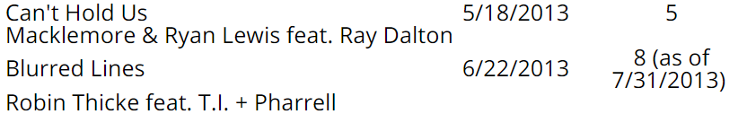

```{r setup, include=FALSE}
knitr::opts_chunk$set(echo = TRUE, message = FALSE, warning = FALSE, max.print = 20, rows.print = 25, df.print = "paged")
library(tidyverse)
library(rvest)
library(stringr)
library(XML)
library(tidyr)
library(readr)
```
# Does Billboard success affect Grammy Success?
We will find how often a Record of the Year or Song of the Year Grammy winner reached the Billboard's Hot 100 #1 spot and if those proportions are different or the same for the two categories. Many people, including me, feel that the Grammys always award the Song of the Year and Record of the Year to songs that are very radio friendly and mainstream hits. We will scrape data from Billboard's webpage on all Hot 100 #1 songs from 1958 to 2013, and compare it to data on record and Song of the Year winners.

## Scraping the Data
We will use the **rvest** library to get and extract values from a website's html. First, we need to find and identify the tables we want in the html. To find specific elements within a HTML document we use CSS Selectors. With CSS Selectors we can identify elements by their type, id, class, attributes, relative position, among other ways. Billboard named the tables of interest with "\<table style="width: 520px;"\>", so we will use the CSS selector "table[style = "width: 520px;"]" to look for table elements with the style attribute set to "width: 520 px;". Unfortunately, Billboard named all their tables that way, even the ones used to jump between time periods, so we will have to extract only the tables we want. You can get more information and practice with CSS Selectors [here](http://flukeout.github.io/#).
```{r scrape attempt1, include=TRUE}
url <- "https://www.billboard.com/articles/columns/chart-beat/5149230/hot-100-55th-anniversary-every-no-1-song-1958-2013"
# we use rvest functions read_html and html nodes to extract the website's tables
table_nodes <- url %>% 
  read_html() %>% 
  html_nodes("table[style = \"width: 520px;\"]") %>%
  magrittr::extract(c(2,5,8,11,14)) #These tables corresponds to the ones will the actual data

#We attempt to turn the first song table (the years 1958-1969) into a data frame
songs_frame <- table_nodes[1] %>%
  html_table(header = TRUE) %>%
  as.data.frame()

head(songs_frame)
```
Next we try turning the first table, songs between 1958 and 1969, into a data frame. However we see an issue with how the original html used a break tag, \<br\> between song name and artist.


The issue is that html_table() did not replace the break tag with anything, so we can't separate the artist from the song name. If html_table() replaced \<br\> with a character, say "\\n", we could then split the value into Song and Artist at the "\\n" character in the string. And since there is no easy way to replace the break with some other value in the XML Nodeset provided by html_nodes, we will have to look towards other techniques to deal with bad html. A good resource for scrapping data off of websites with nice html tables can be found following [this link](http://bradleyboehmke.github.io/2015/12/scraping-html-text.html). However, finding website with nice html tables with the data you are looking for is difficult.

### Scraping Attempt 2
Instead of using html_table() we will use XML::xml_find_all to extract all the text from each row, with "\\n" placed wherever the text in the row was separated. 
```{r scrape attempt2, include=TRUE}
# sapply will apply the function for every row extrated by html_nodes
songs_frame <- table_nodes %>% 
  html_nodes("tr") %>%
  sapply(function(y) {
    paste(xml_find_all(y, ".//text()"), collapse = "\n")}) %>% #.//text() will find text values within the html and paste will convert it to a string
  as.data.frame(table_nodes)  

head(songs_frame)
```

Next we need to split the strings into separate columns, which we use tidyr::separate for. There are a lot of small mistakes in the table that we will have to clean up later. Additionally, we see that values around 1988 have Weeks at #1 as *NA*, this is because the website changed how they entered data in the original html table. 


Instead of having all the information in one row and using a \<br\> to separate Song Name and Artist, they start putting the Artist on a separate row with blank space for peak Date and Weeks at #1. We will unfortunately have to have handle these songs differently.
```{r scrape attempt2.5, include=TRUE}
songs_frame <- songs_frame %>% separate(".", c("Song Name", "Artist", "Peak Date", "Weeks at #1"), sep = "\n") #Also provides names for new columns
songs_frame %>% slice(650:660)
```
### The Second Half of the Songs
Starting with the tables that have songs entered with this new format (3,4, and 5), we turn them into data frames using html_table(), since now we don't have the issue resulting from the earlier use of \<br\>. We can combine the rows of these tables into one using rbind(). Since some of the songs between 1980 and 1989 have been recorded with the old format, we need to exclude those. data_frame_name[rows, cols] to extract all columns of rows after row 174, which is where the change in format occurs. We then use an iterative approach to get the row containing just the Artist name into a new column on the previous row. Then we can use subset to get rid of rows that just contained an Artist name.

```{r scrape other half, include=TRUE}
#We extract the 3 tables with the new html formating and convert tnem into data frames
special_tables <- table_nodes %>% magrittr::extract(c(3,4,5))

special_frame <- special_tables[1] %>% html_table(header = TRUE) %>% as.data.frame()
special_frame2 <- special_tables[2] %>% html_table(header = TRUE) %>% as.data.frame()
special_frame3 <- special_tables[3] %>% html_table(header = TRUE) %>% as.data.frame()

#We can use rbind to combine frames 1, 2 and 3 into 1
special_frame <- rbind(special_frame, special_frame2, special_frame3)

# Since special_frame has songs that we have already placed into our songs_frame we need to ignore those
# so we use [rows,] to extract all rows with songs we havent yet put into songs_frame
special_frame <- special_frame[c(174:nrow(special_frame)),]
head(special_frame)

#we now need to fix the columns, so we create a column for artist, reorder the columds so artist is the second column, and then give the data frame the same column names as songs_frame
special_frame$Artist = ""
special_frame <- special_frame[,c(1,4,2,3)]
names(special_frame) <- c("Song Name", "Artist", "Peak Date", "Weeks at #1")

#In order to get the artist of the song into the proper entity, we will loop through the data frame 
for (i in seq(1, nrow(special_frame), 2)) {
  special_frame[i,]$Artist = special_frame[(i + 1),]$`Song Name`
}
#now we remove those rows which had only the song name
special_frame <- special_frame %>% subset(!is.na(`Weeks at #1`) & `Weeks at #1` != "")
special_frame
```

Now that the second half of the data has been parsed, we can remove all songs in the first half that had the bad format and combine the two data frames into one again with rbind(). e We can start cleaning the data now that we have the data properly placed into a data frame.
```{r combining, include=TRUE}
#we can now combine the two data frames into one, again with rbind
songs_frame <- songs_frame %>% subset(!is.na(`Weeks at #1`))
combined_frame <- rbind(songs_frame, special_frame)
```
## Cleaning
There were numerous mistakes in the source data and our data frame that we now need to fix before we can do any analysis. These mistakes from the Billboard webpage include partial html tags that show up in the data.



And we need to remove the text that sits with the number of weeks "Blurred Lines" has.




Mistakes in our data frame include & being converted to "&amp;" by the **rvest** html functions. To fix these mistakes we will use the **stringr** library, namely str_replace_all and str_trim. We also need to remove the features on a song, so the Artist attribute only includes the primary Artist. We will create a new column to display the song's featuring artists, or None if the song doesn't have any features. Now that we have fixed erroneous data in our data frame we can convert the attributes to their proper types. as.date() will convert the Peak Date attribute to a date type, and type_convert will convert the Number of Weeks at #1 attribute from character to double.
```{r cleaning, include=TRUE}
#removes extra rows that corresponded to the original html headers and replaces erroneous data with the correct value
combined_frame <- combined_frame %>% subset(Artist != "Peak Date" & `Peak Date` != "Peak Date")
combined_frame$Artist <- str_replace_all(combined_frame$Artist, "&amp;", "&")
combined_frame$`Peak Date` <- str_replace_all(combined_frame$`Peak Date`, "/td&gt;[\\s]*", "")
combined_frame$Artist <- str_replace_all(combined_frame$Artist, "/td&gt;[\\s]*", "")
combined_frame$Artist <- str_replace_all(combined_frame$Artist, "&gt;", "")
combined_frame$`Peak Date`<- str_replace(combined_frame$`Peak Date`, "9/11/197", "9/11/1976")

combined_frame$`Weeks at #1` <- str_replace_all(combined_frame$`Weeks at #1`, " \\(as of 7/31/2013\\)", "")
#creates a column for the featuring artists and then removes the featured artists from the Artist column
combined_frame$Features <- ifelse(str_detect(combined_frame$Artist, "feat."),
                                 str_extract(combined_frame$Artist, "feat.*"), "None")

combined_frame$Artist <- str_replace_all(combined_frame$Artist, "feat..*", "")
#removes extra leading and trailing spaces from attributes
combined_frame$Artist <- str_trim(combined_frame$Artist)
combined_frame$`Song Name` <- str_trim(combined_frame$`Song Name`)
combined_frame$`Weeks at #1` <- str_trim(combined_frame$`Weeks at #1`)
combined_frame$`Peak Date` <- str_trim(combined_frame$`Peak Date`)
#converts attibutes to their proper types
combined_frame$`Peak Date`<- as.Date(combined_frame$`Peak Date`, "%m/%d/%Y")
combined_frame <- combined_frame %>% type_convert()
combined_frame
```
## Plotting and Observations
We can now plot and make observations from the data we have scraped and cleaned. One natural question we can now answer is what songs has spent the most consecutive weeks at #1 on the Billboard hot 100. We can do this by arranging the data based on the Weeks at #1 attribute. We use desc() to sort the data so it is descending. Then we can select just the first row and all of the columns with [1,].
We can also create new statistics to analyze through the summarize function. For example here we define "Total Weeks at #1" to be the total number of weeks an artist has spent with a song on the #1 spot. We again arange the data to see that Mariah Carey and The Beatles have spent the most time at the number 1 spot on the Billboard Hot 100. 

```{r easy plotting}
#What is the song with the most weeks at #1
(combined_frame %>%
  arrange(desc(`Weeks at #1`)))[1,]
#looks at the total number of weeks each artist has spent at the number 1 spot on the Billboard Hot 100
combined_frame %>% group_by(Artist) %>% 
  summarize(`Total Weeks at #1` = sum(`Weeks at #1`)) %>%
  arrange(desc(`Total Weeks at #1`))
```
We can also take and plot this data using **ggplot**. We can look at the distribution of Number of Weeks at #1 to see how many songs stayed at #1 for that many weeks. With ggplot we define the plot's mapping of graph elements to values in aes(). For example aes(x = country, y = GDP, color = continent) would map x values to the data's country, y values to the data's gross domestic product, and the color of the data to being dependent on the continent the country belongs to. Then pick how the data will be represented by adding (using the + symbol) geom_line(), geom_point(), geom_bar(), among others. A good resource for customizing ggplot aesthetic and visual elements can be found [here](http://www.sthda.com/english/wiki/ggplot2-axis-ticks-a-guide-to-customize-tick-marks-and-labels).

Here we plot a histogram of the values of Weeks at #1 to see the distribution. The color of the histogram is set with fill = "red", and we add a plot title with labs, and manually set the scale with scale_x_continuous.
```{r easy cont, include=TRUE}
#Histogram of Weeks at #1
combined_frame %>% 
  ggplot(aes(x=`Weeks at #1`)) + 
  geom_histogram(binwidth = 0.5, fill = "red") +
  stat_bin(aes(y=..count.., label=..count..), binwidth = 1, geom="text", vjust=-.5) + #displays count on top of bar
  labs(title = "Weeks at #1 Histogram") + #title
  scale_x_continuous(breaks=seq(0,16,2)) #manually sets scale
```

We create a new data_frame with the Year the song peaked and the number of #1 songs in that year as new attributes. We then take these new attributes and plot the number of #1 songs each year between 1959 and 2012. We exclude 1959 and 2013 from the data since they are incomplete years. We add a regression line using geom_smooth(method = lm) to see if there is a change in the number of #1 songs over the years. We use the **broom** tidy function to display the regression line. Looking at the estimate for slope we see that the number of #1 songs decreases by about .2 per year, assuming everything else is held constant.

```{r easy cont2, include = TRUE}

data_frame <- combined_frame %>% mutate(Year = as.numeric(format(`Peak Date`, "%Y"))) %>%
  group_by(Year) %>%
  summarise(`Number of songs at #1` = n()) %>% #n() gets number of of entities in the group
  arrange(desc(`Number of songs at #1`))
data_frame

#plots the number of #1 songs for that year
data_frame %>% 
  filter(Year != 2013 & Year != 1958) %>%
  ggplot(aes(x = Year, y=`Number of songs at #1`)) + 
  labs(title = "Number of #1 Songs for each Year") +
  geom_point(aes(size=1, color = "red"), show.legend = FALSE) + 
  geom_smooth(method=lm, se = FALSE) #adds a regression line to set how the number of #1 songs has changed over the years.
  
fit <- lm(`Number of songs at #1`~Year, data = data_frame)
broom::tidy(fit)
```
##Further Analysis
If we want to see if being a Billboard Hot 100 #1 songs has an effect on the whether the song wins the Grammy for record or song of the year, we need to get data for record and song of the year winners. Luckily Wikipedia has nice html tables for both the Grammy's Song and record of the year. We again use a CSS selector to find the table element with class wikitable. We then put it in a data frame with html_table() then extract and rename the columns we want using methods from the **magrittr** library. We clean the table by replacing extra information with empty strings, and then filter for year < 2013 since that is the years we have Billboard data for.

```{r table2}
#Website url with table of all record of the year winners
record_url <- "https://en.wikipedia.org/wiki/Grammy_Award_for_Record_of_the_Year"
#website url with table of all song of the year winners
song_url <- "https://en.wikipedia.org/wiki/Grammy_Award_for_Song_of_the_Year"

ROTY_frame <- record_url %>%
  read_html()  %>%
  html_nodes("table.wikitable") %>% #finds table with table element and wikitable class
  html_table(header = TRUE) %>%
  as.data.frame()
ROTY_frame <- ROTY_frame %>% 
  magrittr::extract(c(1,2,3)) %>% #magrittr::extract retrieves only the columns we are interested in
  magrittr::set_colnames(c("Year", "Artist", "Song")) #names columns
ROTY_frame$Artist <- ROTY_frame$Artist %>% str_replace_all("·.*", "") #cleans the table to ignore producers 
ROTY_frame$Song <- ROTY_frame$Song %>% str_replace_all("[*]", "")
ROTY_frame$Song <- ROTY_frame$Song %>% str_replace_all("\"", "")
ROTY_frame$Song <- ROTY_frame$Song %>% str_trim()
ROTY_frame <- ROTY_frame %>% filter(Year > 1958 & Year < 2013) #ignores years outside the scope of our investigation
ROTY_frame

#Scraping this table is basically the same as the previous one
SOTY_frame <- song_url %>%
  read_html()  %>%
  html_nodes("table.wikitable") %>%
  html_table(header = TRUE) %>%
  as.data.frame()
SOTY_frame <- SOTY_frame %>% 
  magrittr::extract(c(1,4,5)) %>% 
  magrittr::set_colnames(c("Year", "Song", "Artist"))
SOTY_frame$Song <- SOTY_frame$Song %>% str_replace_all("[*]", "")
SOTY_frame$Song <- SOTY_frame$Song %>% str_replace_all("\"", "")
SOTY_frame$Song <- SOTY_frame$Song %>% str_trim()
SOTY_frame <- SOTY_frame[,c(1,3,2)] %>% filter(Year > 1958 & Year < 2013) #reorders columns
SOTY_frame
```
Now that we have all the data we need, we can compute the proportion of Grammy winning songs that were also Billboard #1 songs. However, there is still one more difficulty to iron out. Since the same song might have slightly different wording in the Grammy data than the Billboard data, we cannot just search for and exact match between song names. We create our own song matching function to fix this issue. The function cleans away potential extra information than compares string using **grep**. If grep matches to multiple strings, then the string closest in string length is the one selected.  
```{r comparison}
#Given a grammy winning song attempt to match it to a #1 song
match_songs <- function(x) {
  songs <- str_replace_all(x, "[(].*[)]", "") %>% #attempts to get rid of extra information
  str_trim() %>%
  grep(combined_frame$`Song Name`, ignore.case = TRUE)
  
  min = 1000
  min_index = 1
  if (length(songs) > 1) { #if grep matches with more than 1 song, we pick the song closest in string length 
    for (i in seq(1:length(songs))) {
      length_dist = abs(str_length(x) - str_length(combined_frame$`Song Name`[songs[i]]))
      if (length_dist < min) {
        min = length_dist
        min_index = i
      }
    }
    songs[min_index]
  }
  else if (length(songs) == 1) {
    songs
  }
  else { #grep failed to match a song 
    FALSE
  }
}

sum = 0
for (i in seq(1:nrow(SOTY_frame))) {
  songs <- match_songs(SOTY_frame$Song[i])
  if (songs != FALSE) { sum = sum + 1 } # Counts number of SOTY winners that were also a #1 song
}
# Repeats for Record of the Year winners
sum2 = 0
for (i in seq(1:nrow(ROTY_frame))) {
  songs <- match_songs(ROTY_frame$Song[i])
  if (songs != FALSE) { sum2 = sum2 + 1 }
}
Award_Type <- c("Song of the Year", "Record of the Year")
Number <-  c(sum,sum2)
proportion <-  c(sum/nrow(SOTY_frame), sum2/nrow(ROTY_frame))
data.frame(Award_Type, Number, proportion) %>% magrittr::set_colnames(c("Award Type", "Number of Grammy Winning and Hot #1 Songs", "Proportion"))
```
The proportion of Grammy winning songs, for both categories, that were also Billboard Hot 100 #1 songs is just above 50%. This proportion is lower than I expected and doesn't fit the narrative that the Grammys always give these awards to the artists with the most commercially successful songs. 
It is interesting that the number is the same for both award types. I figured that the song of the year award would have a higher proportion, since the award focuses more on the song's songwriting which I assumed was the most important factor for getting a #1 song.

